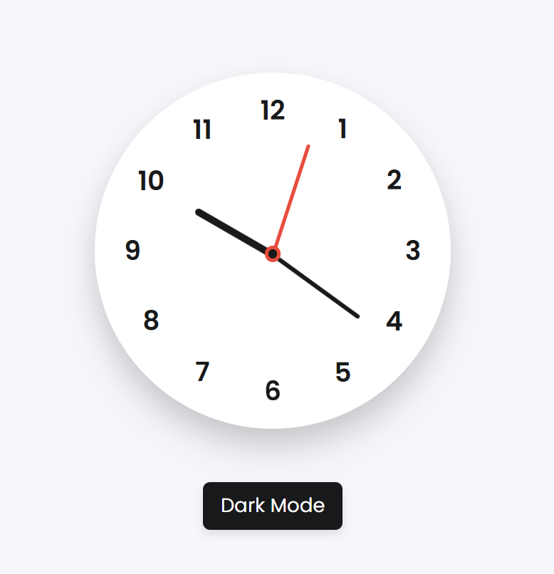

# 🕐 Analog Clock

A simple and responsive **Analog Clock Web Application** built using **HTML, CSS, and JavaScript**. The clock displays the current system time with smoothly positioned hour, minute, and second hands.

The application also includes a **Dark Mode** feature with `localStorage` support, so the selected theme is remembered after refreshing the page.

## 🚀 Live Demo

 🔗 **[Analog Clock](https://analogclock-five.vercel.app/)**

## 📌 Project Overview

The Analog Clock is a lightweight frontend project created to demonstrate:

* Real-time clock functionality
* JavaScript Date object
* CSS transformations and positioning
* Responsive web design
* Dark/Light theme switching
* Browser Local Storage
* CSS media queries

## ✨ Features

* 🕐 Real-time analog clock
* ⏱️ Hour, minute, and second hands
* 🌙 Dark Mode / Light Mode
* 💾 Saves theme preference using Local Storage
* 📱 Fully responsive design
* 💻 Works on desktop, tablet, and mobile devices
* 🎨 Clean and simple user interface
* ⚡ Lightweight and fast

## 🛠️ Technologies Used

* **HTML5** – Structure of the application
* **CSS3** – Styling, clock design, animations, and responsive layout
* **JavaScript** – Real-time clock functionality and theme switching
* **Local Storage** – Stores the selected theme
* **Google Fonts** – Poppins font

## 📂 Project Structure

```text
Analog_Clock/
│
├── index.html
├── Style.css
├── Script.js
└── README.md
```


```

## 🌙 Dark Mode

The application provides a Dark Mode / Light Mode toggle.

```


## 📱 Responsive Design

The clock is designed to work across different screen sizes using CSS media queries.

Supported devices include:

* 🖥️ Desktop
* 💻 Laptop
* 📱 Mobile
* 📲 Tablet

## ▶️ Run Locally

1. Clone the repository:

```bash
git clone https://github.com/NileshPadalwar/Analog_Clock.git
```

2. Open the project folder:

```bash
cd Analog_Clock
```

3. Open `index.html` in your browser.

You can also use **Live Server** in VS Code for a better development experience.

## 📸 Preview




## 👨‍💻 Author

**Nilesh Padalwar**

Frontend / Angular Developer

🔗 GitHub: https://github.com/NileshPadalwar

## 📄 License

This project is created for learning and portfolio purposes.
